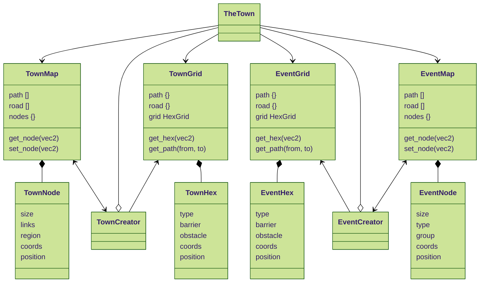
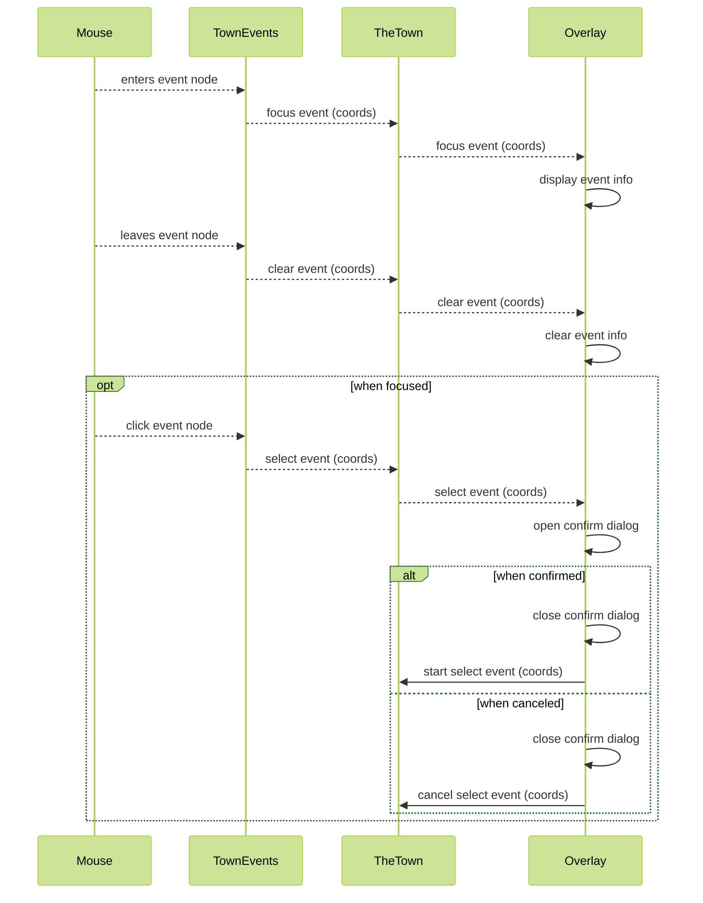
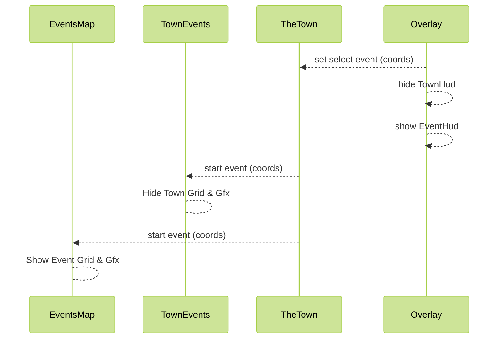
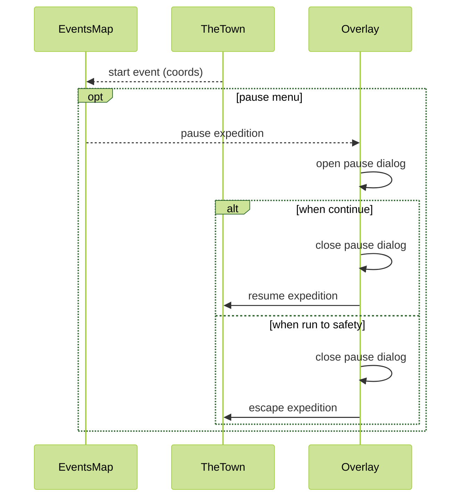

# Technical Overview

As the player is selecting a character to play a town map is generated for the game.

## Game Design

### Prepphase

> MVP: Skips this phase: The player is presented with the town map and possible expeditions to choose from.

The player uses downtime to move across the map and or gather resources.

### Expedition

The player starts an expedition by selecting the location on the town map.

---
## Technical

Two map types get generated procedurally where the town map contains multiple event maps. While there is some overlap there is a split between the required functionality and the visual representation of the underlying information.

When a new game starts the town map is generated and populated with a pseudo-random selection of event nodes. When a play selects an event node on the town map and starts an expedition the map zooms in to the node as the details get generated and drawn onto the screen.

High-level object overview:


---
### Select an Event

In the preperation phase the user is presented with a town map and has a certain amount of time to complete the daily tasks.

> For the MVP the only available progress are expedition events.


---
### Shoping Event
> TODO Implementm Not part of the MVP

### Reseache Event
> TODO Implementm Not part of the MVP

### Expedition Event

Expedition events start by the player hovering the mouse over an event on the town map and then deciding to select the event. Once the event is started the town map fades out while zooming in and enters the expedition mode.

Entering the expedition mode means the start of the expedition loop. **Where the goal is to?**






---
## Visual

### The Town Map

A 2D map showing roads, points of interest, and region indicators. The center of the town is more urban areas, more to the outside it gets rural, and on the outskirts, there may be more abandoned/unused areas. The map is managed as a hexagonal tilemap. This means around 42 tiles to map all possible edges and transitions between types.

Requires all tilesets needed to cover regions, roads, paths, building types, and the surrounding forest.

#### Generator Config

###### Config v1
Big Map (+-90 Nodes)
```
var cfg = {
	"zoom": 16,
	"nodes": 192,
	"culler": 0.35,
	"spread": Vector2(620.0, 40.0),
	"type_a_dist": 7680000,
	"type_a_offset": 384,
	"type_b_dist": 25600000,
	"type_b_offset": 512,
	"type_c_dist": 76800000,
	"type_c_offset": 768,
}
```

Small Map (+-60 Nodes)
```
var cfg = {
	"zoom": 14,
	"nodes": 96,
	"culler": 0.25,
	"spread": Vector2(160.0, 20.0),
	"type_a_dist": 5120000,
	"type_a_offset": 384,
	"type_b_dist": 12800000,
	"type_b_offset": 512,
	"type_c_dist": 51200000,
	"type_c_offset": 768,
}
```

###### Config v2
Big Map (+-60 Nodes)
```
const BIG_MAP = {
	"zoom": 16,
	"nodes": 128,
	"culler": 0.35,
	"spread": Vector2(620.0, 40.0),
	"grid_size": Vector2(1280.0, 720.0),
	"center": 7680000,
	"center_offset": 384,
	"outer": 25600000,
	"outer_offset": 512,
	"edge": 51200000,
	"edge_offset": 768,
}
```

Small Map (+-30 Nodes)
```
const SMALL_MAP = {
	"zoom": 14,
	"nodes": 56,
	"culler": 0.25,
	"spread": Vector2(160.0, 20.0),
	"grid_size": Vector2(1024.0, 576.0),
	"center": 2560000,
	"center_offset": 128,
	"outer": 7680000,
	"outer_offset": 256,
	"edge": 25600000,
	"edge_offset": 512,
}
```

### The Expedition Map

As with the town map, the base is a hex map that is more detailed than the town map and has more 2.5D visual aspects. The base textures also need 42 tiles to map all possible edges and transitions between types. Exceptions are that some of the detail or building types may only have edges on top the or bottom of a hex.

Several tilesets are required per type of setting and region on the map.

---

**Ref.** Tilemap for hex based grids
**Note:** To reduce the workload layered hard edges can be used where suited. Meaning that an edge tile covers another tile to create the transition. The result is that the top edge tile texture can be used to define multiple transitions without having to manually create all maps.
